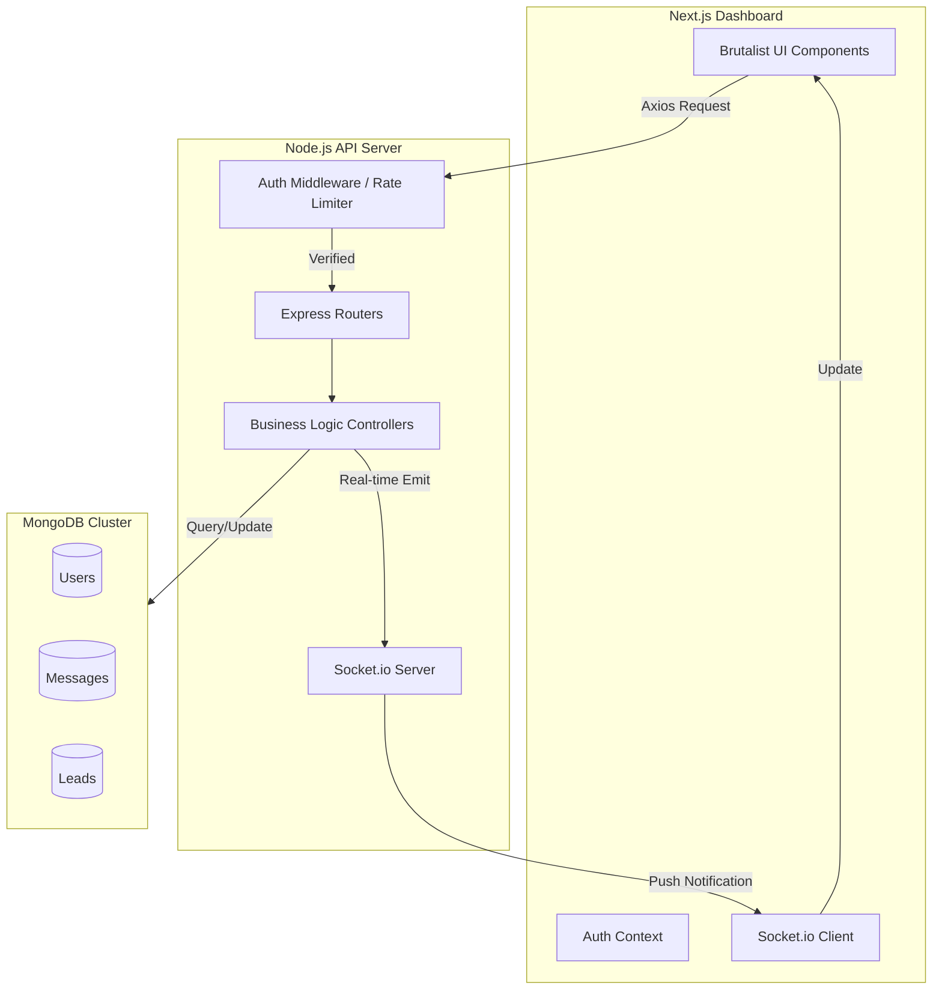

# System Diagram

## System Interaction Logic
1. **User Action**: Personnel logs in.
2. **Backend**: Validates credentials, generates JWT.
3. **Frontend**: Stores token, connects to Socket server.
4. **Operations**: Any data change (Task completion, Message sent) triggers both a DB update and a Socket emission to relevant nodes.
